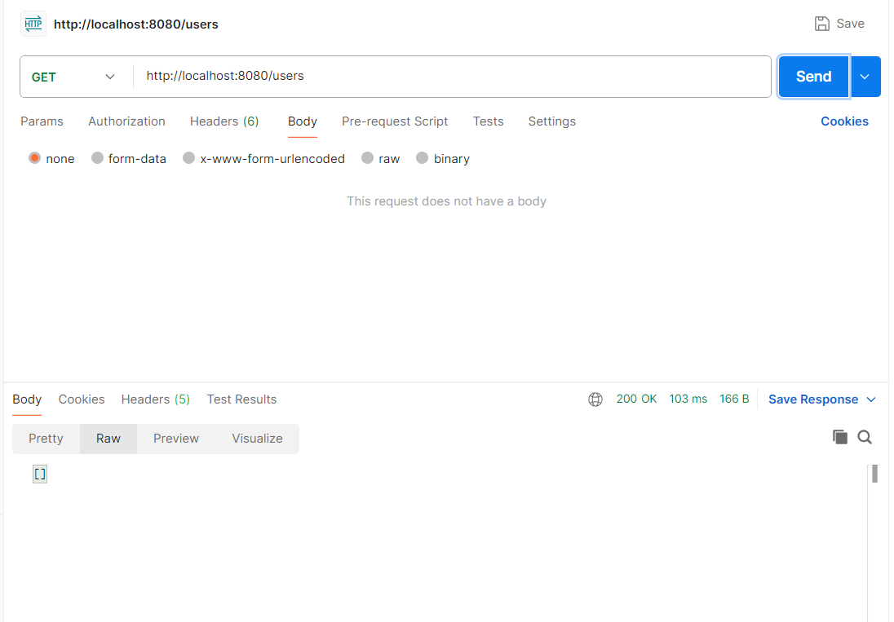
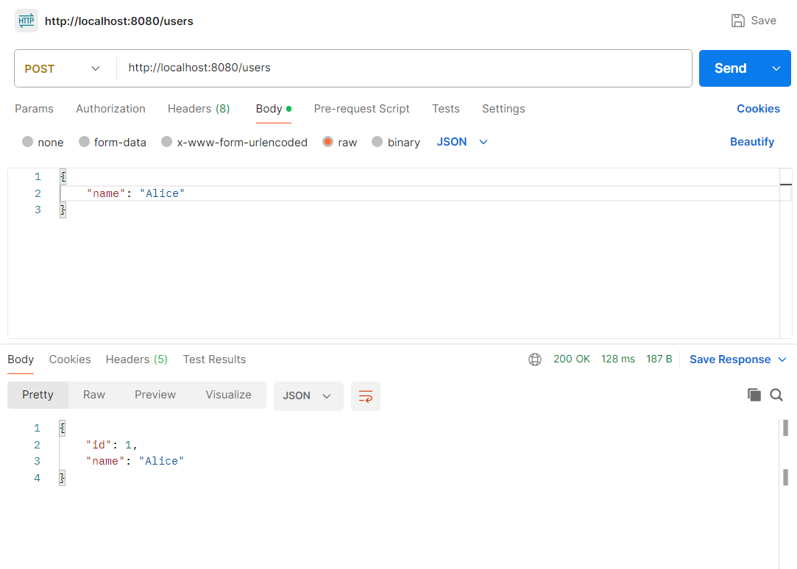
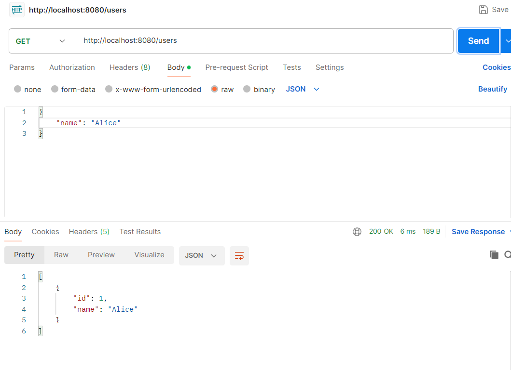
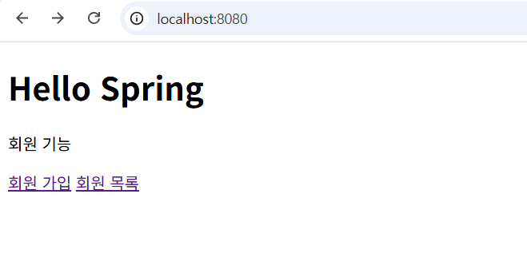
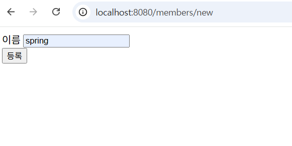
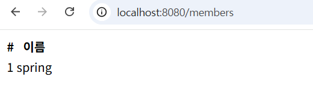

# Simple User API
Spring Boot 기반의 간단한 User CRUD REST APi 예제입니다.

## Tech Stack
- Java
- Spring Boot
- Gradle

## Package Structure
- controller
- service
- repository
- domain

## API Endpoints
- GET /users
- GET /users/{id}
- POST /users
- PUT /users/{id}
- DELETE /users{id}

## How to Run
1. Run DemoApplication
2. Access http://localhost:8080

---
## Example Request / Response (Postman)

### 1. GET /users (no users)
초기 상태에서 사용자 목록 조회

---
### 2. POST /users
새 사용자 생성 요청

**Request Body**
'''json
{
  "name": "Alice"
}

---
### 3. GET AFTER POST /users
사용자 생성 후 사용자 목록 조회

## Features
- MVC 기반 회원 등록 / 조회 화면
- Thymeleaf 템플릿 렌더링
- In-Memory Repository 구현

--
### 1. Home
- 회원 기능 메인 화면

### 2. Create User(Form)

### 3. User List(After Create)

