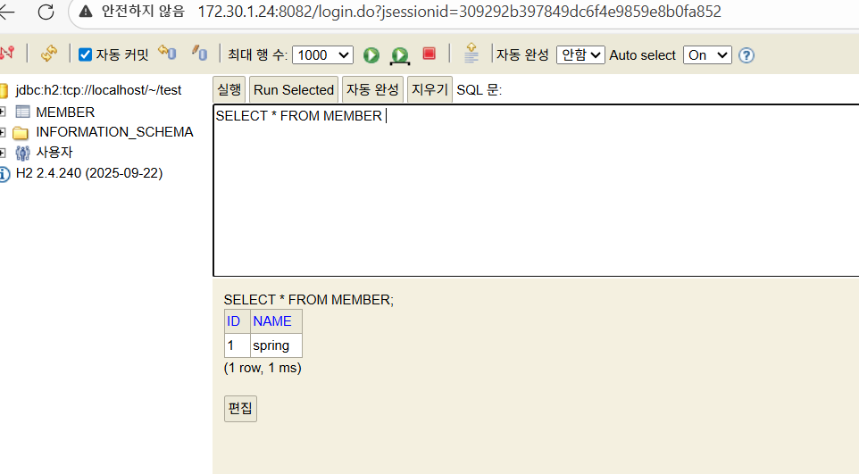

# Simple User API
Spring Boot 기반의 간단한 User CRUD REST API 예제입니다.
이 프로젝트는 처음에 REST API로 구현되었고, 이후 Thymeleaf를 사용한 MVC 페이지로 확장되었습니다.

## Tech Stack
- Java
- Spring Boot
- Gradle

## Package Structure
- controller
- service
- repository
- domain

## API Endpoints
- GET /users
- GET /users/{id}
- POST /users
- PUT /users/{id}
- DELETE /users{id}

## How to Run
1. Run DemoApplication
2. Access http://localhost:8080

---
## REST API Example Request / Response (Postman)

### 1. GET /users (no users)
초기 상태에서 사용자 목록 조회

---
### 2. POST /users
새 사용자 생성 요청

**Request Body**

---
### 3. GET AFTER POST /users
사용자 생성 후 사용자 목록 조회

## MVC Pages (w.Thymeleaf)
- MVC 기반 회원 등록 / 조회 화면
- Thymeleaf 템플릿 렌더링
- In-Memory Repository 구현

---
### 1. Home
- 회원 기능 메인 화면

---

### 2. Create User(MVC) 
- 회원 등록 화면(MVC)

---

### 3. User List(After Create)
- 회원 등록 후 목록 조회

---
## H2 DB 입력/조회/변경
- Spring Boot + JDBC + H2 Database를 사용해 사용자 등록(Create), 조회(Read), 수정(Update) 기능을 구현했습니다.

---
### 1. Read H2-DB
-H2 DB 회원 조회 화면

